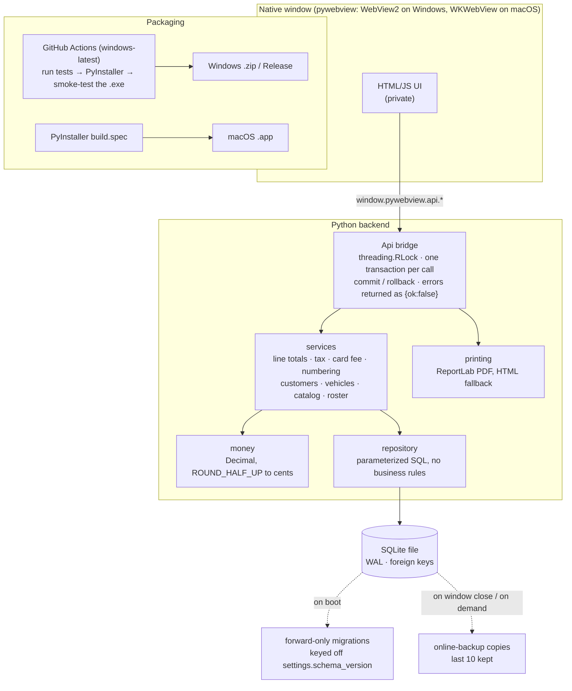
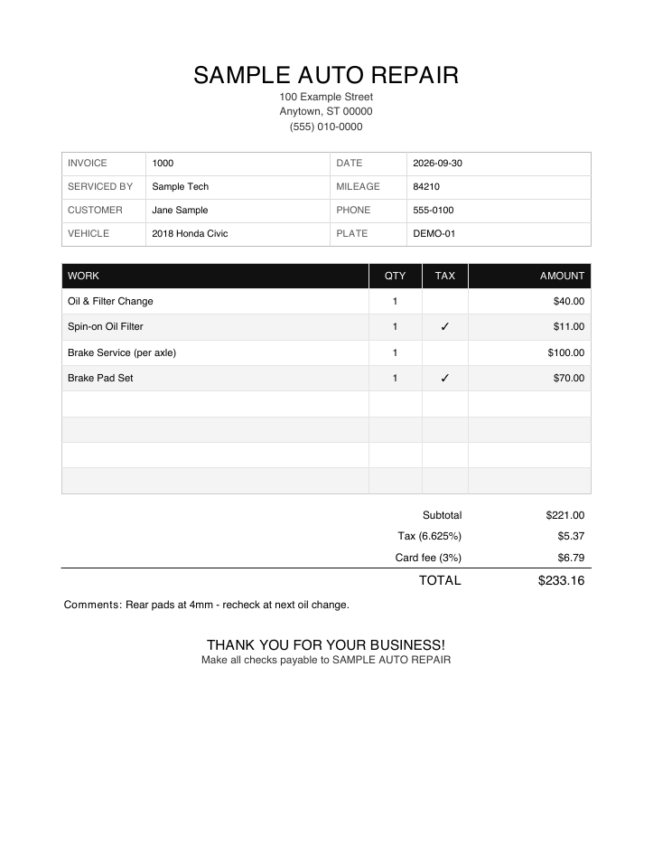

# Whiting Auto Center Invoicing System

An offline desktop invoicing app I built for an independent auto repair shop. This repository is a
public extract of its backend, runnable headless.

## The problem

The shop kept its invoices in a paper/spreadsheet book. It needed something at the front desk that
could build an invoice from a labor/parts price list,
apply tax the way the state requires (parts yes, labor no, rounded the way a calculator rounds),
optionally add a card surcharge, print a receipt, and pull up a customer's history. It had to keep
working with no internet connection and no server. It also had to run as a plain download on the
shop's Windows PC, with no Python install, and it couldn't lose a sale if the app crashed halfway
through saving one.

## Architecture (full system)



This repository contains everything in the **Python backend** box, the migrations and the backups.
The UI, the real seed data and the packaging files stay private (see below). In the extract, `Api` is
driven from a CLI demo and from tests instead of the webview.

## Key technical decisions

**1. Money is `Decimal`, rounded half-up to cents, and only the backend does it.**
Binary floats round 6.625 down to 6.62, and 6.625 is exactly what 6.625% tax on a $100 part comes
to. `money.py` coerces every value through `Decimal(str(x))`, quantizes with `ROUND_HALF_UP`, and
sends the UI numbers it can display without doing any arithmetic. The card fee is charged on
`subtotal + tax` (the processor charges on the amount swiped) and is not taxed itself.
*Tradeoff:* values are stored as SQLite `NUMERIC` and turned back into floats at the JSON boundary,
so every read path has to go back through `money()`. Integer cents would be stricter, at the cost of
converting at every boundary with the dollar-based UI.

**2. One connection, one lock, one transaction per bridge call.**
pywebview dispatches JS calls on worker threads. `Api` holds a single SQLite connection behind a
`threading.RLock`, and every write goes through `_write()`: run the service function, `commit()`,
or `rollback()` on any exception. Validation errors come back as `{"ok": false, "error": ...}`
instead of being raised across the JS bridge. A save that creates a customer, advances the invoice
counter and inserts line items either happens completely or not at all (`test_api.py` forces a crash
in the middle to check this).
*Tradeoff:* all access is serialized. That is fine for one front-desk PC, but it would not scale to
multiple clients. Using a single connection also means `check_same_thread=False`, which is safe only
because the lock is the one way in.

**3. Each invoice keeps the rates it was written at.**
The tax rate and card fee are shop defaults stored in `settings`, and each invoice saves a snapshot.
Completed invoices are finished sales: they reprint with their original numbers after the default
changes, and they never gain a card fee later. Open invoices keep following the live defaults until
they are completed.
*Tradeoff:* this took three migrations to get right (v4 added the snapshot, v5 added the fee, v6
reopened open invoices that v4/v5 had frozen by mistake). A single global rate would have been
simpler and wrong for history.

**4. Forward-only migrations keyed off `settings.schema_version`, plus automatic backups.**
`db._migrate()` runs numbered steps v2 through v6. Each `ALTER TABLE` checks `PRAGMA table_info`
before adding a column, and no step deletes data. Examples: v3 turns the free-text `serviced_by`
names already on invoices into a real `mechanics` table and links the invoices to it; v2 adds soft
deletes so a customer with completed invoices is archived, not deleted. `backup()` uses SQLite's
online backup API, so it is safe while the database is open. It runs when the window closes and
keeps the last 10 copies.
*Tradeoff:* there are no down-migrations. Restoring means copying a backup over the file.

**5. A native window around a web UI, packaged with PyInstaller, with CI that runs the real `.exe`.**
pywebview keeps the UI in HTML/JS without bundling Chromium or running a local server. PyInstaller
cannot cross-compile, so the Windows build runs on a GitHub Actions `windows-latest` runner on every
push to `main`. That job runs the backend tests, builds the app and launches the built `.exe` in a
smoke-test mode. It then launches it again after tagging every file with a Mark-of-the-Web
`Zone.Identifier`. This reproduces a crash the shop hit with a downloaded copy: .NET refused to load
the bundled pythonnet DLLs, which the build machine never showed.
*Tradeoff:* the build is unsigned, so Windows SmartScreen warns on first launch.

## Numbers (verified from the source)

| | |
|---|---|
| Production backend | 2,186 lines of Python (`app/*.py` + `run_app.py`) |
| Production test suite | 50 test functions in `tests/test_backend.py` |
| Schema migrations | v2 → v6, `SCHEMA_VERSION = 6` |
| Backups retained | last 10 |
| This extract | 59 tests: the 50 ported + 9 new (v1 migration, `Api` transaction/lock/backup/printing, draft-line merge) |

## Sample output

Generated by `python -m shopledger.demo` with fictional data:



## What's in this repo vs. private

| In this repo | Kept private |
|---|---|
| `money.py`: unchanged from production | The shop's real labor/parts price list and mechanic roster (`seed.py`) |
| `db.py`: schema, migrations v2–v6, backups (the legacy technician name replaced; the backup folder is now a parameter) | The HTML/JS front end, icons and branding |
| `repository.py`: unchanged from production | The pywebview launcher, PyInstaller spec, Windows build script and the full build/smoke-test workflow |
| `services.py`, split into `rules.py` / `shaping.py` / `roster.py` to keep files short; rules unchanged | The shop's name, address and phone number on the printed receipt |
| `api.py`: same transaction wrapper; the backup path and the print destination are now parameters so it runs headless | Every real database, backup, customer, vehicle and invoice |
| `printing.py`: same layout, **fictional shop header** | Git history of the production repo |
| `seed.py`: **toy** catalog (4 fictional items), one mechanic "Sample Tech", numbering from 1000 | |
| `add_line()`: backend port of the UI's draft-line de-dup fix (match on name + type) | |

Tests that depended on the real seed (catalog sizes, the shop's starting invoice number, a specific
part price) were rewritten against the toy seed. All other tests are the production assertions,
with fictional names and prices in place of the originals.

The full system is in a private repository; I'm happy to walk through it or grant read access during an interview.

## Quickstart

Requires Python 3.11+ (CI runs 3.12 on Ubuntu and Windows).

```bash
python -m venv .venv
source .venv/bin/activate            # Windows: .venv\Scripts\activate
pip install -r requirements.txt

python -m shopledger.demo            # temp DB, invoice, forced rollback, sample_invoice.pdf
python -m pytest -q                  # 59 tests
```

The demo prints something like:

```
saved invoice #1000  totals {'subtotal': 221.0, 'tax': 5.37, 'ccFee': 6.79, 'total': 233.16}
failing write -> {'ok': False, 'error': 'Unexpected error: simulated crash mid-transaction'}
  before {'customers': 1, 'invoices': 1, 'next_invoice_no': '1001'}
  after  {'customers': 1, 'invoices': 1, 'next_invoice_no': '1001'}
  rolled back: yes
```

## Layout

```
shopledger/
  api.py         Api facade: RLock, one transaction per call, {ok:false,error} on failure
  services.py    invoices, customers, vehicles, catalog, bootstrap, dashboard
  rules.py       tax / card-fee defaults and validation, coercers
  roster.py      mechanics: active mechanic, soft delete, rename propagation
  shaping.py     sqlite3.Row -> JSON-ready dicts
  repository.py  SQL only
  db.py          schema, migrations, backups
  money.py       Decimal money + totals
  printing.py    ReportLab PDF receipt, HTML fallback
  seed.py        toy first-run data
  paths.py       per-user data dir (SHOPLEDGER_HOME overrides)
  demo.py        python -m shopledger.demo
tests/           pytest suite
```

## License

MIT. See [LICENSE](LICENSE).
